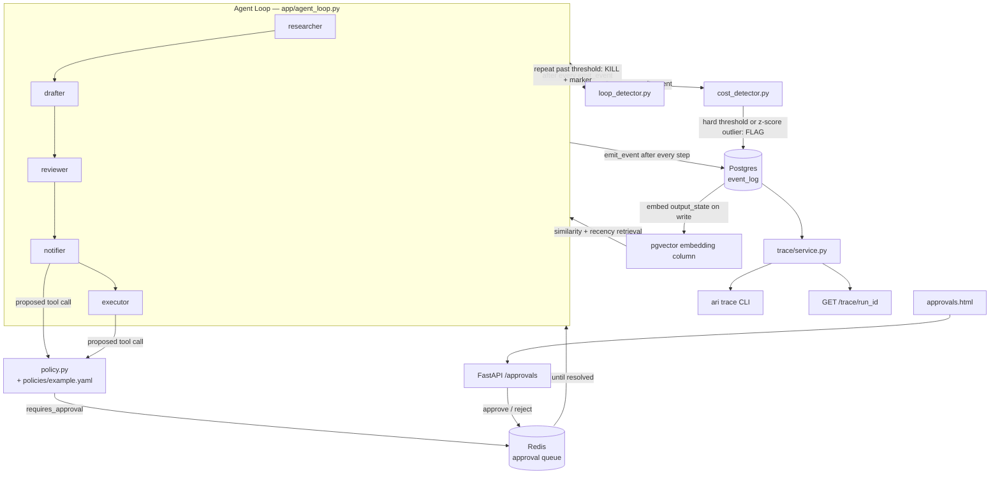

# Agent Reliability Infrastructure (ARI)

Multi-agent LLM frameworks handle orchestration — deciding what an agent
does next. They don't handle what happens when that orchestration runs
somewhere you can't just watch it: agents lose context on hand-off,
call tools with bad or repeated arguments, take unsafe autonomous
actions with no human check, and burn budget with no visibility into
why. ARI is a control-plane layer that sits between an agent
orchestrator and the underlying model calls and addresses four of
those problems directly: curated context hand-off between agents,
human-approval gates on risky tool calls, full trace/replay
debugging, and inline loop/cost-anomaly detection.

This repo is a working, end-to-end implementation of all four — a real
3-agent pipeline (researcher → drafter → reviewer) instrumented so a
single demo run exercises every piece together.

## Architecture



## Setup

Requires Docker, Python 3.12, and (for real LLM calls) an
[Anthropic API key](https://console.anthropic.com/).

```bash
git clone <this-repo>
cd Agent_Reliability_Infrastructure

cp .env.example .env
# edit .env and set ANTHROPIC_API_KEY if you want real (non-mocked) LLM calls

docker compose up -d          # Postgres (pgvector) + Redis
python3.12 -m venv .venv
source .venv/bin/activate
pip install -r requirements.txt
alembic upgrade head          # applies all 4 migrations

pytest                        # optional: 17 tests, ~6s, needs the containers running
```

## Run the demo

Three entrypoints, each exercising a different slice of ARI. All take
an optional `--mock` flag to run with a free, deterministic fake LLM
instead of the real Anthropic API (no key needed, no cost — useful for
rehearsing before an interview).

```bash
# Full success path: 3-step pipeline with curated retrieval, then two
# tool calls that both pause for human approval. Requires ANTHROPIC_API_KEY
# unless --mock is passed.
python -m app.cli demo success

# In another terminal, serve the trace viewer + approval UI:
uvicorn app.main:app --reload
# -> open http://localhost:8000/approvals/ui, approve each pending action
# -> the "demo success" process resumes automatically within ~1s of each approval

# Loop detection: same 3 LLM steps, then a tool call repeated past the
# threshold — the run is auto-killed.
python -m app.cli demo loop --mock

# Cost-anomaly detection: same 3 LLM steps, then one deliberately
# "expensive" step (simulated token count) — flagged, not killed.
python -m app.cli demo cost --mock

# View any run's trace:
python -m app.cli trace <run_id>
# or in a browser: http://localhost:8000/trace/<run_id>
```

## What this demonstrates

| Feature | Where it lives |
|---|---|
| **1. Curated state hand-off** — agents retrieve top-k relevant prior context (similarity + recency decay) instead of the full raw transcript | `app/embeddings.py` (embed on write), `app/retrieval.py` (`get_relevant_context`), wired into `app/agent_loop.py`'s `_run_llm_steps` |
| **2. Human-approval gates** — a YAML policy engine flags risky tool calls; the agent loop pauses and resumes on approval via a Redis-backed queue | `app/policy.py`, `policies/example.yaml`, `app/approvals/queue.py`, `app/approvals/gate.py`, `/approvals/*` routes in `app/main.py`, `app/templates/approvals.html` |
| **3. Trace/replay debugging** — every step (and every detector flag) is a row in a structured event log, viewable via CLI or web | `app/events.py` (`emit_event`), `app/trace/service.py`, `python -m app.cli trace`, `GET /trace/{run_id}` |
| **4. Loop & cost-anomaly detection** — inline checks after every step, not an offline job; loops auto-kill, cost anomalies flag | `app/anomaly/loop_detector.py`, `app/anomaly/cost_detector.py`, `app/anomaly/markers.py`, wired into `app/agent_loop.py` |

See [ARCHITECTURE.md](ARCHITECTURE.md) for the design details behind each of these (the `emit_event()` contract, the policy config format, the retrieval scoring formula, the detection logic).

## Screenshots

Not included in this repo yet — capture these yourself from a live
`demo success` / `demo loop` run (see [ARCHITECTURE.md](ARCHITECTURE.md#capturing-screenshots) for exact steps):

1. Trace viewer showing a full `demo success` run (retrieval + approval steps visible)
2. Approval UI with a pending action, before clicking approve
3. Trace viewer for a `demo loop` run, showing the `LOOP_DETECTED` flag

## Known limitations / what a production version would add

This is a demo-scale, single-machine implementation built to prove the
mechanisms work end-to-end, not a production system. Explicitly out of
scope today:

- **No auth** — the approval UI and API have no authentication; anyone
  who can reach the FastAPI process can approve/reject actions.
- **No horizontal scaling** — the agent loop is a single blocking
  process per run; pausing for approval ties up that process for the
  run's lifetime (see the pause/resume tradeoff discussion in
  ARCHITECTURE.md). A production version would decouple execution from
  the process that started it (durable task queue / workflow engine).
- **Fake tools** — `send_email` / `execute_action` are placeholders
  that prove the gating mechanism, not real integrations.
- **Local embedding model, no ANN index tuning** — `sentence-transformers`
  running in-process is fine at demo scale (a handful of events per
  run); a production system with large per-run event counts would want
  pgvector's approximate-nearest-neighbor indexes (IVFFlat/HNSW) tuned
  for its data volume, and likely a dedicated embedding service instead
  of loading a model per process.
- **No retry/backoff on the Anthropic API call** — a transient API
  error fails the step rather than retrying.
- **Single Postgres instance, no read replicas or backup strategy.**
- **Cost tracking is tokens, not dollars** — a production version would
  map tokens to actual per-model pricing for a real budget signal.
